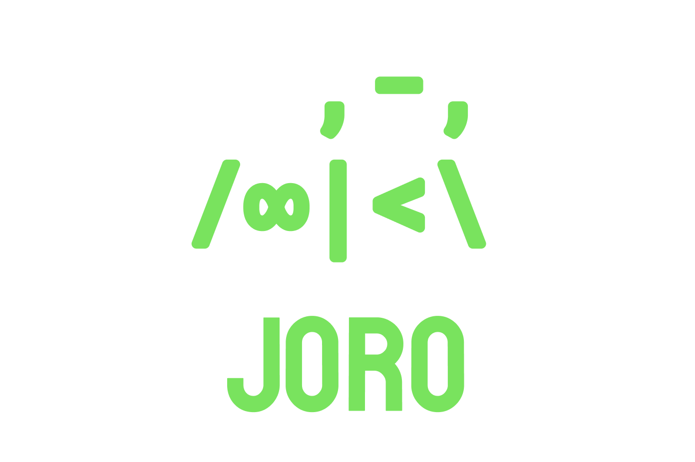

<p align="center">
</p>
<p align="center">In a very basic way this allows you to load dom nodes and strings like dependencies.</p>
<hr>
<p align="center">
<a href="https://opensource.org/licenses/MIT">
  
</a>
</p>

---
# Why is this useful?
- JSS is over complicated for small projects
- Its easy to add styles for functional components
- its tiny, simple functional and i love using it.

```js

var html = require('nanohtml')
var joro = require('joro');

var styles = new joro();

function HeaderComponent(){
    styles.add("HeaderComponent", `
        h1 { color: hotpink }
    `)
    var el = html`
        <h1>Hello planet</h1>
    `
    document.body.appendChild(el)
}
```
congratulation its a functional component 🎉

You can add HTML nodes on route change of styles, mount points or anything! 🌈

 ```js
var page = require('pagejs')
var styles = new joro();

page('/user', () => {
    styles.add("HeaderComponent", `
        .user-profile { color: hotpink }
    `)
    loadTheUI();
})
 ```
